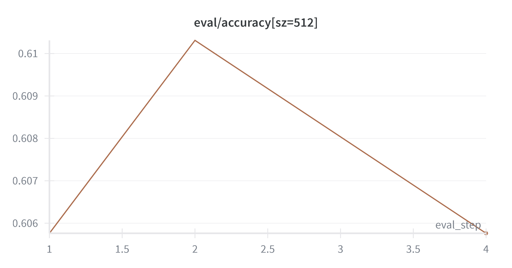
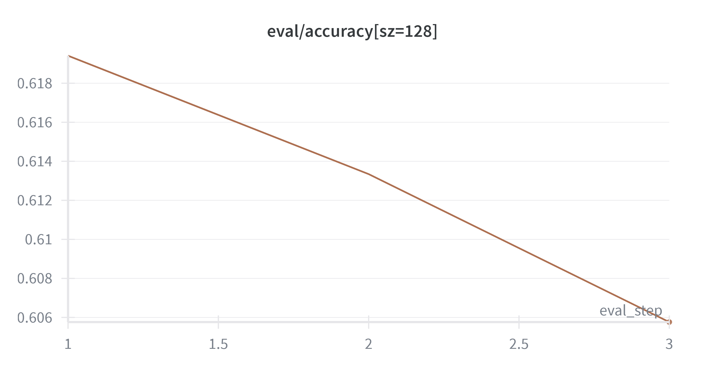
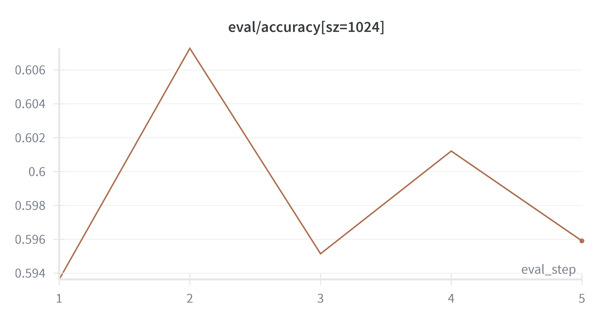
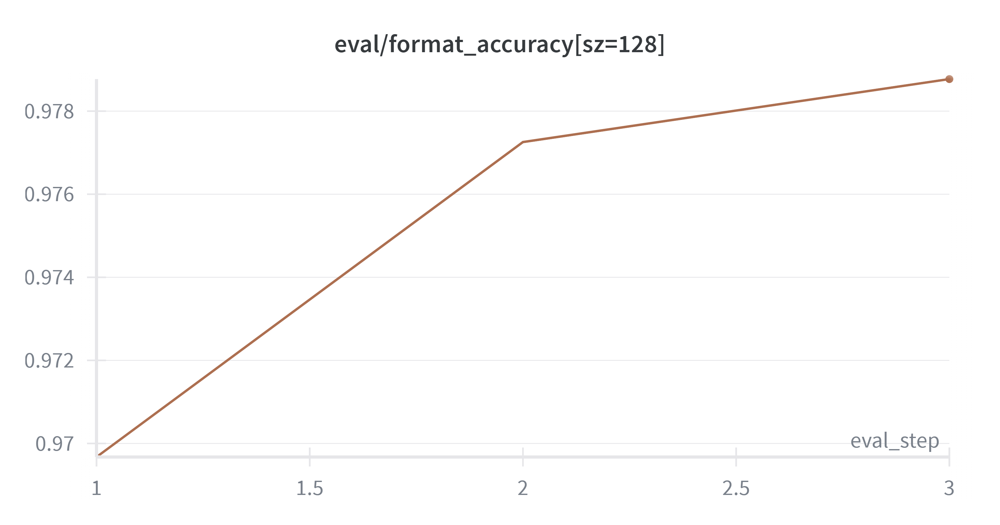
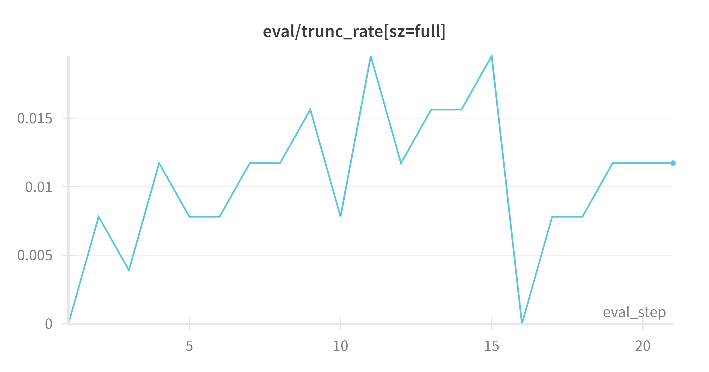
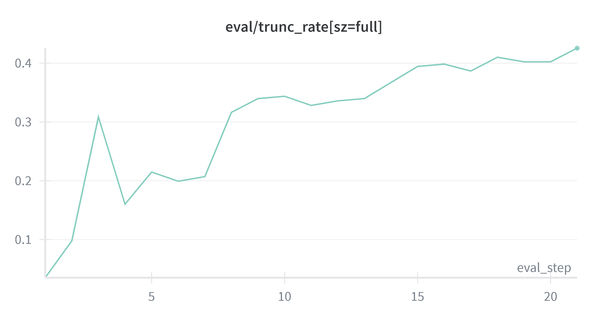
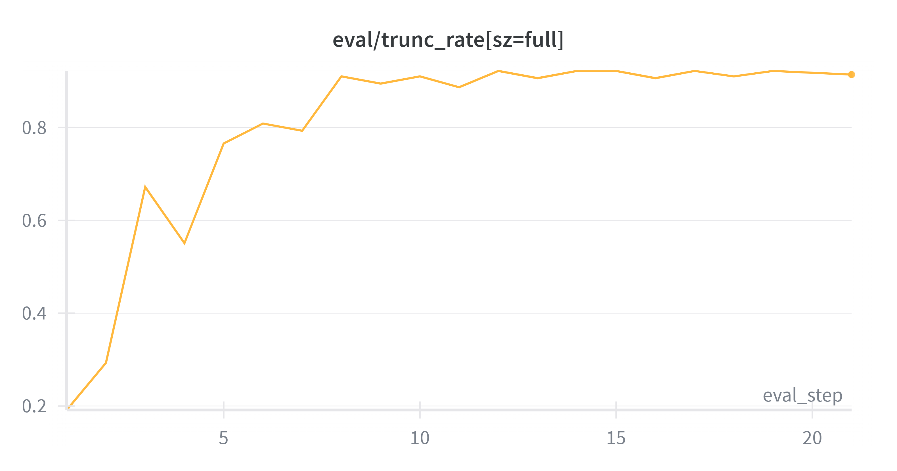
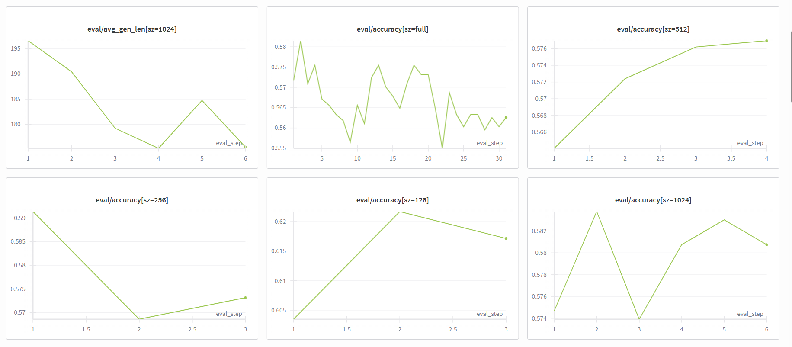
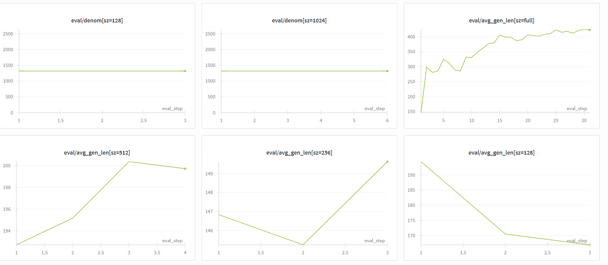

# SFT / LoRA / EI / GRPO
### TODO: LoRA /EI / GRPO 部分待完善

## 快速配置
### TODO: 把这里写成代码形式
git clone 实验代码
uv sync安装所需要的包(可使用国内源)
python sft_gsm8k.py一键开始SFT

## SFT 实验报告：Qwen2.5-1.5B on GSM8K(on 2 nvidia L40S)

本阶段实验使用 **Qwen2.5-1.5B Base** 模型在 **GSM8K** 数据集上进行监督微调（SFT）。实验重点在于探索不同数据规模（Data Scaling）对模型推理能力的影响，以及验证 SFT 在推理任务中作为“格式适配器”的作用。

### 1. 实验设置与超参数 (Experimental Setup)

为了在有限显存下优化训练效果，通过 `argparse` 实现了灵活的超参数配置。关键配置如下：

* **Base Model**: `Qwen/Qwen2.5-1.5B`
* **Dataset**: GSM8K (SFT Train/Test)
* **Training Config**:
    * `batch_size`: 12 (配合 `gradient_accumulation_steps=1`，适应单卡显存)
    * `lr`: 1e-5 (较低的学习率以防止破坏预训练权重)
    * `epochs`: 3
    * `max_len`: 1024
* **Scaling Experiment**: 对比了不同训练集大小 `[128, 256, 512, 1024, Full]` 的效果。

### 2. 核心实验结果 (Key Results)

实验在 Base 模型基础上取得了显著提升，特别是在小样本下表现出不错的数据效率，而且生成长度控制在100+tokens的范围，不会出现越来越啰嗦的情况。(eval_acc在整个gsm_8k上测评，不会引入随机性。minibatch=12是带来随机性的主要原因)

### 3. 关键发现 (Takeaways)
#### SFT 的数据效率极高 (Alignment Tax is Low)
即使只用 128 或 256 条 数据，模型的验证集准确率（Validation Accuracy）也会相比 Base 模型有明显的提升，format_accuracy更是直接从0升至接近100%。(eval_gsm8k_base.py测得Qwen2.5-1.5B模型在gsm8k测试集上准确率为52.08%，format_acc接近0%，上面给一张format size = 128的，其它size类似)

SFT 的主要作用不是向模型注入新的数学知识（Base 模型在预训练阶段已经看过了海量的数学 Token），而是激活特定的行为模式（Format/Style）。
结论： 只需要很少的样本，就能教会模型"如何像一个解题者一样思考（输出 CoT 推理过程）"

#### 边际效应递减 (Diminishing Returns)
随着数据量从 128 -> 1024 -> Full 增加，准确率却并没有显著提升。
观察点： 从 0 到 128 的提升是巨大的，而随着train_size scale，test accuracy并没有相应的scale(甚至有减少)。x
想要冲击更高准确率，只靠SFT是不够的。

#### 在SFT阶段， "Data Quality > Quantity" ？
虽然只跑了不同大小，但因为gsm8k里面不含脏样本，所以不太好做数据清洗
高阶结论： 在 SFT 阶段，数据的质量或许比数量重要。引入脏样本可能降低模型性能。

#### 超参数调优的重要性
在实验中发现，针对 1.5B 小模型，超参数的微调至关重要：
* **Learning Rate (1e-5)**：使用了较为保守的学习率(batchsize = 12)。由于数据集较小（如 512 样本），过大的 LR 容易导致过拟合或破坏原有的预训练特征。

lr = 1e-5

lr = 2e-5

lr = 3e-5

更小/更适宜的学习率可由社区未来进一步探索

* **Batch Size (12)**：

batchsize 16 -> 导致OOM(在nVidia L40S 显卡上)

batchsize 64 ->

在 BS=64 下，模型没有学会“停止”和“收敛”。它陷入了逻辑循环，或者在不断地堆砌无效的推理步骤（Hallucination），导致推理链路过长且无效，最终答案自然也是错的。

batchsize 8 -> token吞吐量不如 batchsize 12

在显存允许范围内尽可能大了 Batch Size，保证了梯度的相对稳定性。虽然代码支持梯度累积（Gradient Accumulation），但在当前配置下，直接处理 BS=12 已经能取得不错的收敛效果。后续可由社区自行尝试其它batchsize。

* **gen_max_new_tokens (1024)**

对不同 train_size 的 SFT 实验，引入了 trunc_rate 和 avg_gen_len 两个指标，用来分析生成是否被长度上限截断。

将 gen_max_new_tokens 从 512 调整为 1024（并将 vLLM 的 max_model_len 提到 4096）后：
full_size run 的 trunc_rate 从原先的潜在高值显著降到 < 3%，
与此同时 format_accuracy 从 ~0.5 提升到 ~0.99，accuracy 也从 ~0.52 提升到 ~0.60 左右，
证明之前 full_size 实验中的性能劣化主要源于生成被过短的长度上限截断，而非大数据本身的问题。

对小规模训练集（尤其是 128）：
trunc_rate 明显高于其他规模，说明在 20% 左右的问题上，模型会持续生成直到触碰长度上限；
但这部分样本在 1024 之前仍然往往包含 #### 答案，因此 format 几乎都正确，数值 accuracy 也还不错；
这反映出小数据 SFT 在“何时停止生成”这一点上的不稳定性

#### 下一步计划
鉴于 SFT 在 128 样本下已达到 0.61 的 Accuracy，后续将以此 Checkpoint 为起点（Warm-start），引入强化学习（如 GRPO/Expert Iteration），探索能否突破 SFT 的性能天花板。/ 引入LoRA, 探索性能方面的优化

---